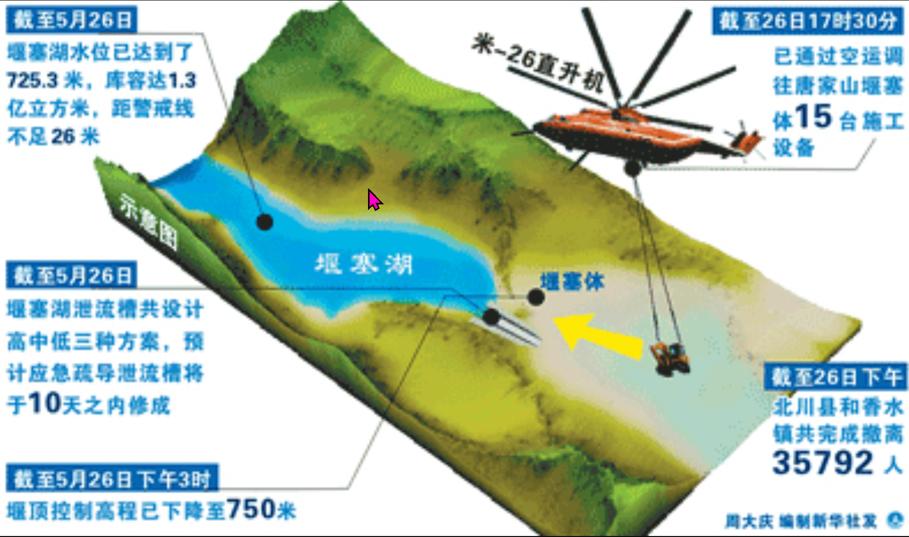

# img-renew

一個基於 Rust 開發的圖片放大與清晰化工具，支援傳統卷積核心銳化和 AI 模型超解析度兩種處理模式。

## 功能特點

- 🎯 **圖片放大**：使用 Lanczos3 插值算法進行 2x 放大
- ✨ **傳統銳化**：基於卷積核心的圖片清晰化處理
- 🤖 **AI 增強**：支援 ONNX 模型進行深度學習超解析度處理
- 📝 **文字優化**：特別適合提升圖片中文字的清晰度
- 🚀 **純 Rust 實現**：無外部運行時依賴，跨平台支援

## 安裝與編譯

### 系統需求

- Rust 1.89.0 或更高版本
- Cargo 套件管理器

### 編譯專案

```bash
# 開發模式編譯
cargo build

# 發布模式編譯（優化性能）
cargo build --release
```

## 使用方法

### 傳統模式（卷積銳化 + 2x 放大）

```bash
cargo run -- <輸入圖片> <輸出圖片> <清晰化強度>
```

**範例：**
```bash
cargo run -- test.png output.png 1.5
```

**清晰化強度建議值：**
- `0.5-1.0`：輕度銳化（細膩）
- `1.5`：標準銳化（平衡）
- `2.0-3.0`：強力銳化（明顯）

### AI 模式（ONNX 模型增強）

```bash
cargo run -- --onnx <模型路徑> <輸入圖片> <輸出圖片>
```

**範例：**
```bash
cargo run -- --onnx ./model/Real-ESRGAN-x4plus_float/model.onnx test.png output.png
```

**快速測試腳本：**
```bash
# 傳統模式測試
./test.sh

# AI 模式測試
./test-onnx.sh
```

## 效果對比

### 原始圖片


這是一張包含中文文字的資訊圖，展示了堰塞湖的處理情況。

### 傳統銳化版（強度 3.0）


使用卷積核心進行 2x 放大和銳化處理，文字邊緣更清晰。

### AI ONNX 增強版


使用 ONNX 模型進行 AI 超解析度處理，保留更多細節和色彩。

## 推薦 AI 模型

針對文字清晰化，推薦以下 ONNX 模型：

### 1. Real-ESRGAN-x4plus
- **來源**：[HuggingFace - qualcomm/Real-ESRGAN-x4plus](https://huggingface.co/qualcomm/Real-ESRGAN-x4plus)
- **特點**：通用型超解析度，對文字和圖片均有良好效果
- **下載**：
  ```bash
  wget https://huggingface.co/qualcomm/Real-ESRGAN-x4plus/resolve/main/Real-ESRGAN-x4plus_float.onnx.zip
  unzip Real-ESRGAN-x4plus_float.onnx.zip -d model/Real-ESRGAN-x4plus_float/
  ```

### 2. TextSR
- **特點**：專門針對場景文字圖片的超解析度，整合 OCR 引導
- **適用**：包含大量文字的圖片

### 3. GOT-OCR2.0
- **特點**：結合 OCR 識別和高解析度處理
- **適用**：需要同時提升文字識別和清晰度的場景

## 技術架構

### 核心數據結構

```rust
struct ImageProcessor {
    image: DynamicImage,
}
```

### 處理流程

#### 傳統模式
```
載入圖片 → 2x 放大 (Lanczos3) → 卷積銳化 → 儲存
```

#### AI 模式
```
載入圖片 → 預處理 (縮放、正規化、NCHW) → ONNX 推論 → 後處理 → 縮放至 2x → 儲存
```

### 卷積核心原理

銳化核心使用 3×3 矩陣：

```
[neighbor_weight, neighbor_weight, neighbor_weight]
[neighbor_weight, center_weight,  neighbor_weight]
[neighbor_weight, neighbor_weight, neighbor_weight]
```

其中：
- `neighbor_weight = -intensity`
- `center_weight = 1.0 - (8.0 × neighbor_weight)`
- **核心總和必須等於 1.0** 以保持亮度

**範例（強度 1.5）：**
```
[-1.5, -1.5, -1.5]
[-1.5, 13.0, -1.5]
[-1.5, -1.5, -1.5]
```

計算：`13.0 + (8 × -1.5) = 13.0 - 12.0 = 1.0` ✓

## 依賴函式庫

| Crate | 版本 | 用途 |
|-------|------|------|
| `image` | 0.25.1 | 圖片讀取、編碼、縮放 |
| `imageproc` | 0.25.0 | 圖片處理（卷積濾鏡） |
| `tract-onnx` | 0.21.0 | ONNX 模型推論（CPU） |
| `ndarray` | 0.15.6 | 多維陣列運算 |

## GPU 加速支援

### 目前狀態
**CPU 模式**（使用 `tract-onnx`）

### 為什麼沒有 GPU 支援？
- `tract-onnx` 是純 Rust 實現，無 GPU 加速
- **優點**：無外部依賴、輕量級、跨平台
- **缺點**：處理速度較 GPU 慢

### GPU 加速替代方案

#### 選項 1：ort crate (Rust)
支援 CUDA/DirectML/TensorRT，但需要：
```toml
[dependencies]
ort = { version = "2.0", features = ["cuda", "directml", "download-binaries"] }
```
**注意事項**：
- 需要兼容的 MSVC 工具鏈
- 需要 ONNX Runtime 預編譯二進位檔
- 可能遇到連結器兼容性問題

#### 選項 2：Python + onnxruntime-gpu（推薦）
最穩定的 GPU 推論方案：
```python
import onnxruntime as ort
session = ort.InferenceSession("model.onnx", providers=['CUDAExecutionProvider'])
```

#### 選項 3：手動編譯 ONNX Runtime
從源碼編譯，啟用 GPU 支援。

## 專案結構

```
img-renew/
├── src/
│   └── main.rs           # 主程式
├── model/                # ONNX 模型目錄
│   └── Real-ESRGAN-x4plus_float/
│       └── model.onnx
├── test.png              # 測試圖片
├── test_result_normal.png    # 傳統銳化結果
├── test_result_onnx.png      # AI 增強結果
├── test.sh               # 傳統模式測試腳本
├── test-onnx.sh          # AI 模式測試腳本
├── Cargo.toml            # Rust 專案配置
├── CLAUDE.md             # Claude Code 開發指南
├── DEVELOP.md            # 開發文檔（中文）
└── README.md             # 本文件
```

## 開發指南

### 調整銳化強度

修改 `src/main.rs` 中的 `create_sharpen_kernel` 函數：

```rust
fn create_sharpen_kernel(intensity: f32) -> [[f32; 3]; 3] {
    let neighbor_weight = -intensity;
    let center_weight = 1.0 - (8.0 * neighbor_weight);
    [
        [neighbor_weight, neighbor_weight, neighbor_weight],
        [neighbor_weight, center_weight,  neighbor_weight],
        [neighbor_weight, neighbor_weight, neighbor_weight]
    ]
}
```

**規則**：
- 提高 `intensity` → 更強銳化效果
- 降低 `intensity` → 更柔和效果
- 總和必須為 1.0 以保持亮度

### 修改 AI 模型輸入尺寸

在 `sharpen_ai` 方法中修改：

```rust
let model_input_size = 128;  // 改為模型需要的尺寸
```

不同模型可能需要不同的輸入尺寸（如 224、256、512）。

## 常見問題

### Q: 為什麼 AI 模式比較慢？
A: 目前使用 CPU 推論。若需加速，考慮使用 GPU 方案（參見上方說明）。

### Q: 支援哪些圖片格式？
A: 支援常見格式：PNG、JPEG、WebP、TIFF、BMP、GIF 等。

### Q: 如何處理大型圖片？
A:
- 傳統模式：可直接處理大圖
- AI 模式：模型輸入會縮放至固定尺寸（128×128），適合小圖或區塊處理

### Q: 能否批次處理多張圖片？
A: 目前不支援，但可透過 shell 腳本實現：
```bash
for img in *.png; do
    cargo run -- "$img" "output_$img" 1.5
done
```

## 授權協議

本專案使用 MIT 授權協議。詳見 LICENSE 文件。

## 貢獻

歡迎提交 Issue 和 Pull Request！

### 待辦事項
- [ ] 支援批次處理
- [ ] 整合 GPU 加速（ort crate）
- [ ] 添加更多圖片處理功能（降噪、色彩增強）
- [ ] 提供 GUI 介面
- [ ] 支援動態調整模型輸入尺寸

## 參考資源

- [tract-onnx 文檔](https://docs.rs/tract-onnx/)
- [image crate 文檔](https://docs.rs/image/)
- [Real-ESRGAN 論文](https://arxiv.org/abs/2107.10833)
- [ONNX Model Zoo](https://github.com/onnx/models)
- [HuggingFace Models](https://huggingface.co/models?pipeline_tag=image-to-image)

## 聯繫方式

如有問題或建議，請透過 GitHub Issues 聯繫。

---

**開發時間**：2025
**開發語言**：Rust
**主要用途**：圖片放大與清晰化，特別適合提升文字圖片品質